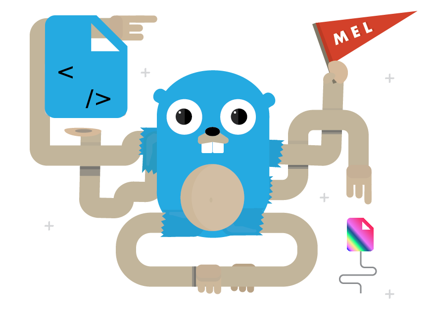

<p align="center">

</p>

> _**Heads up!**_ Gonzo is being polished at this stage so some APIs may change.  
> Gonzo is a refinment of Slurp.

# Gonzo [](https://godoc.org/github.com/omeid/gonzo)
Go file-processing Framework based on Go [Pipelines](http://blog.golang.org/pipelines) concept.

- Convention over configuration
- Explicit is better than implicit.
- Do one thing. Do it well.
- ...

### Use Case
- Web App Development
- Log Analysis
- Continuous Integration
- Content Mangement Systems

### Why?
For an explanation of why Gonzo was written read on its predecessor, [slurp](https://github.com/omeid/slurp)


## Design

Gonzo is made up of File, Context, Stages, and Pipes.


### File
File is an interface that mimics os.File with some additional APIs.

### Pipes
Pipe holde a channel of files, a context for logging and deadlines, and a simple interface to pass files through a Stage.

### Stages
Stages are where files are handled for processing.

Currently the follow stages are implemented, but writing new stages are supper simple.

[ace](https://github.com/go-gonzo/ace) Compile Ace templates.  
[archive/tar](https://github.com/go-gonzo/archive/tar) Work with tar archives.  
[archive/zip](https://github.com/go-gonzo/archive/zip) Work with zip Archives.  
[css](https://github.com/go-gonzo/js) Minify CSS  
[filter](https://github.com/go-gonzo/filter) A collection of stages for filtering files.  
[fs](https://github.com/go-gonzo/fs) Read and Write from Disk.  
[gcss](https://github.com/go-gonzo/gcss) Compile gcss to css.  
[gin](https://github.com/go-gonzo/gin) A Go Server lifereload utlity.  
[github](https://github.com/go-gonzo/github) Grab files from github.  
[html](https://github.com/go-gonzo/html) Minify HTML  
[js](https://github.com/go-gonzo/js) Minify JavaScript  
[livereload](https://github.com/go-gonzo/livereload) Livereload  
[passthrough](https://github.com/go-gonzo/passthrough) Pass files through any executable.  
[resources](https://github.com/go-gonzo/resources) go-resources binding.  
[s3](https://github.com/go-gonzo/s3) Put files to S3.  
[scss](https://github.com/go-gonzo/scss) Compile SCSS to CSS.  
[util](https://github.com/go-gonzo/util) Some helpful utlites.  
[watch](https://github.com/go-gonzo/watch) Watch files for change.  
[web](https://github.com/go-gonzo/web) Grab files from any URL.  
## Example

To compile scss files, minify the output, write it to disk, lifereload in browser, and upload it to Amazon S3, this all you need:

```go
err := s.Src(context.Background(), "app/style.scss").Then(
    util.Trim("app"),
    scss.Compile(),
    css.Minify(),
    fs.Dest("./public/assets/"),
    lr.Reload(),
    s3.Put(s3conf),
    )
//Handle any _fatal_ error.
```

## TODO:
- Finish this doucment.
- Add tests
